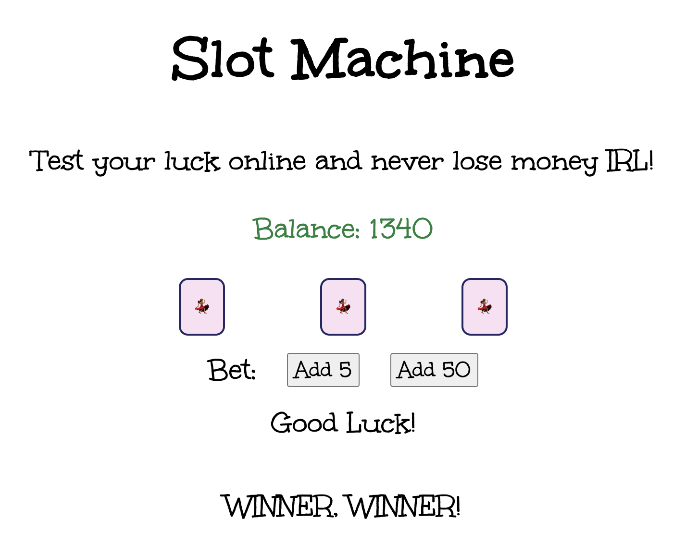

# Project Title: Slot Machine

### Goal: Build a Simple Slot Machine

This project is a simple slot machine with minimum 5 items per reel and 3 reels. The user should be able to bet min or max and have their total update. 

## Languages Used: HTML, CSS, JavaScript

### Try it yourself! Fork and clone from the master branch of this repo to make this project your own!